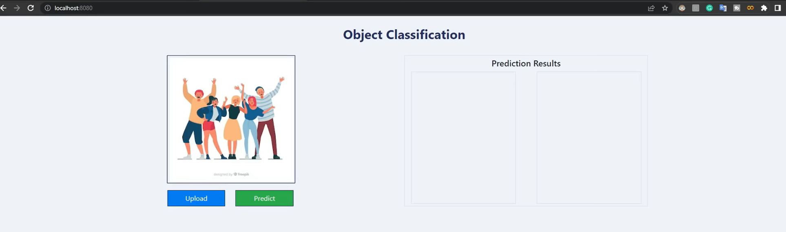
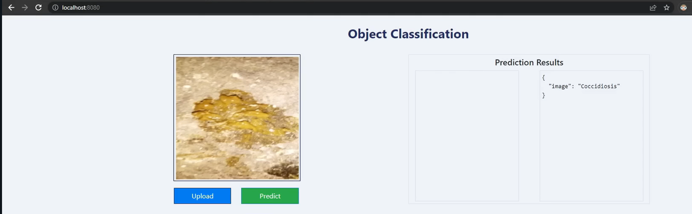

# This is end-to-end chicken disease classification (Computer Vision) project.

## Technologies Used

[](https://flask.palletsprojects.com/en/1.1.x/) [](https://gunicorn.org) [](https://scikit-learn.org/stable/) 
<p>
<a></a>
<a></a>
<a></a>
<a></a>
<a></a>
<a></a>
</p>


## Problem Statement
Chickens have several diseases, but if they have coccidiosis, they will die.  

## Goal
The major goal is to create a model that can accurately predict if a chicken has coccidiosis disease or not. 

## Solution: 
I used a chicken fecal picture to forecast coccidiosis illness. Based on the fecal pattern, the model will be able to forecast the disease. The model is trained on both healthy and harmful fecal pictures.
This study focuses on forecasting the coccidiosis disease utilizing an image classification, i.e., transfer learning technique of the deep learning library. Pretrained-Tensorflow/Keras. I'll feed the custom data into the pretrained Tensorflow model to make the forecast.


## Demo



## Workflow

1. Update the config.yaml  
2. Update the secrets.yaml [OPTIONAL] #DB credentials  
3. update the params.yaml 
4. update the entity 
5. update the configuration manager in src config
6. update the components
7. update the pipeline 
8. update the main.py
9. Update the dvc.yaml file
10. update the app.py file

## How to run?

### Option 1:
#### STEPS:

1. Create a virtual environment for this application.
```bash
conda create -p venv python=3.10 -y
```

2. Activate the virtual environment.
```bash
conda activate venv/
```

3. Clone this GitHub Repository.
```bash
git clone https://github.com/paragj30/chicken-disease-classification.git
```

4. Enter inside the chicken-disease-classification folder.
```bash
cd \chicken-disease-classification
```

4. Install all the libraries and dependencies present in the "requirements.txt" file.
```bash
pip install -r "requirements.txt"
```

5. Run the application.
```bash
python app.py
```

6. Open the web browser and copy past the link below:
```bash
127.0.0.1:8080/predict
```

### DVC Command
1. dvc init
2. dvc repor
3. dvc dag

### Option 2:
#### STEPS:

1. Open the Docker Desktop

2. Download the docker image:
```bash
docker docker pull paragj30/chicken-disease-classification-app:latest
```

3. Run the docker image command:
```bash
docker run -d -p 8080:8080 paragj30/chicken-disease-classification-app
```

4. Open the web browser and copy past the link below:
```bash
127.0.0.1:8080/predict
```


## HTML and CSS Template example:
1. https://getbootstrap.com/docs/4.0/components/forms/
2. https://colorlib.com/wp/themes/unapp/


## Description: About the deployment

1. Built docker image of the source code.

2. Pushed a docker image to Elastic Container Registry (ECR). 

3. Launched EC2 Instance.

4. Pulled the image from ECR in EC2 Instance.

5. Lauched the docker image in EC2 Instance.


## AWS-CICD-Deployment-with-Github-Actions

### 0. Create the Dockerfile and CICD.yaml file

### 1. Login to AWS console.

### 2. Create IAM user for deployment

Policy for Identity Access Management (IAM) User with specific access:

    1. AmazonEC2ContainerRegistryFullAccess
ECR Access: Elastic Container registry to save your docker image in AWS.

    2. AmazonEC2FullAccess
EC2 access : It is virtual machine.


### 2. Create and download the Access key and Secret access key to authenticate the GitHub Action with AWS account.

    1. AWS_ACCESS_KEY_ID

    2. AWS_SECRET_ACCESS_KEY


### 3. Create ECR repository to store/save docker image.

1. AWS_ECR_LOGIN_URI: 56637341692.dkr.ecr.us-east-1.amazonaws.com/chicken

Save the URI of our docker repository. This repository will be accessible to GitHub Action through this URI.

2. ECR_REPOSITORY_NAME: Save the name of the docker repository.


### 4. Create EC2 Virtual Machine (Ubuntu). 

1. Select the "Ubuntu" OS Image as it is a lightweight virtual machine compared to the Windows VM.

2. Select the Ubuntu Server LTS (free tier) with 64-bit architecture. 

3. Select the Instance Type (Configurations of the Ubuntu VM Server) RAM, CPU and memory

4. Generate the Key pair (.pem file) to securly connect to the EC2 Instance via PuttyGen/Mobaxtrem.

5. Create a Security group by selecting the SSH, HTTP and HTTPS traffic from the internet. This group is a firewall that controls the traffic of the EC2 Instance.

    5.1 Edit the Indbound rules to  run the application. Select the "Custom TCP" and add the port number (8080).

6. Launch the EC2 Instance.

7. Connect to EC2 Instance using EC2 Instance Connect(launch terminal on tab) or SSH Client(3rd party client like PuttyGen/Mobaxtrem).
 
 

### 5. Open EC2 and Install docker in EC2 Machine:

check if any external packages are installed or not
```bash
    ls 
```
```bash
    clear 
```

To update the all package manager and dependencies in VM Instane

```bash
	sudo apt-get update -y 
```
```bash
	sudo apt-get upgrade 
```
```bash
    clear
```
	
** Required

To check if docker is installed or not

    docker --version 

To download the docker in the EC2 virtual machine instance

	curl -fsSL https://get.docker.com -o get-docker.sh 

To check if docker.sh file is downloaded or not. docker.sh file will have all the links and command for the docker download and installtion.

    ls 

To open and read the docker.sh file.

    cat get-docker.sh 

To run the docker.sh file. This will trigger the installation of docker.

```bash
	sudo sh get-docker.sh 
```

```bash
	sudo usermod -aG docker ubuntu
```

```bash
	newgrp docker
```

```bash
    docker --version 
```

To check the docker images

    docker ps  


### 6. Configure EC2 as self-hosted runner:

1. Self-hosted runner is a another VM Instance present on GitHub. So we will make a EC2 Instance as Self-hosted runner, that will make a connection with GitHub to pull the updated changes from GitHub to EC2 Instance.

    
2. 
Open the GitHub Repository>

Setting>

Actions>

Runner>

New self-hosted runner> 

choose "Linux" os> 

then copy, paste and run command one by one on 'EC2 Instance Connect Terminal' to make the connection with GitHub.

Download
#### Create a folder in EC2
```bash
mkdir actions-runner && cd actions-runner
```
#### Download the latest runner package
```bash
curl -o actions-runner-linux-x64-2.316.1.tar.gz -L https://github.com/actions/runner/releases/download/v2.316.1/actions-runner-linux-x64-2.316.1.tar.gz
```
#### Optional: Validate the hash
```bash
echo "d62de2400eeeacd195db91e2ff011bfb646cd5d85545e81d8f78c436183e09a8 actions-runner-linux-x64-2.316.1.tar.gz" | shasum -a 256 -c
```
#### Extract the installer
```bash
tar xzf ./actions-runner-linux-x64-2.316.1.tar.gz
```

Configure of GitHub Action on EC2.
#### Create the runner and start the configuration experience
```bash
./config.sh --url https://github.com/paragj30/chicken-disease-classification --token A26L7RJ6ZKLB7VA7M44AJT3GKIKFM
```

- 2.1 Enter the name of runner: self-hosted
  
#### Last step, run it!
```bash
./run.sh
```
Here, AWS EC2 will get connected to the GitHub Action.
  
3. Make sure that the status of the 'self-hosted' runner is always "Idle": GitHub is connected to the EC2 Instance.


### 7. Setup github secrets:

So that GitHub can access the EC2 Instance.

Open the GitHub Repository >

Setting >

Security >

Secrets and variables > 

Actions > 

New repository secret > 

Add the below informations:
 
    AWS_ACCESS_KEY_ID=

    AWS_SECRET_ACCESS_KEY=

    AWS_REGION = us-east-1

    AWS_ECR_LOGIN_URI = paste the URI of the Docker repository present inside the ECR.

    ECR_REPOSITORY_NAME = chicken


### 8. Setup .github/workflows directory inside the GitHub repository:

1. By default GitHub Actions will search the '.github/workflows' directory.

2. Create the CICD.yaml and define workflow in that file.


### 9. Open the Public URL of the Application

1. Open EC2 Instance and copy the Pubic IPv4 address and paste it in the browser URL:8080

2. Successfully deployed the application.


### 10. Change the URL.

- Buy the desried domain and change the URL to the new domain.
